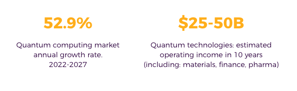
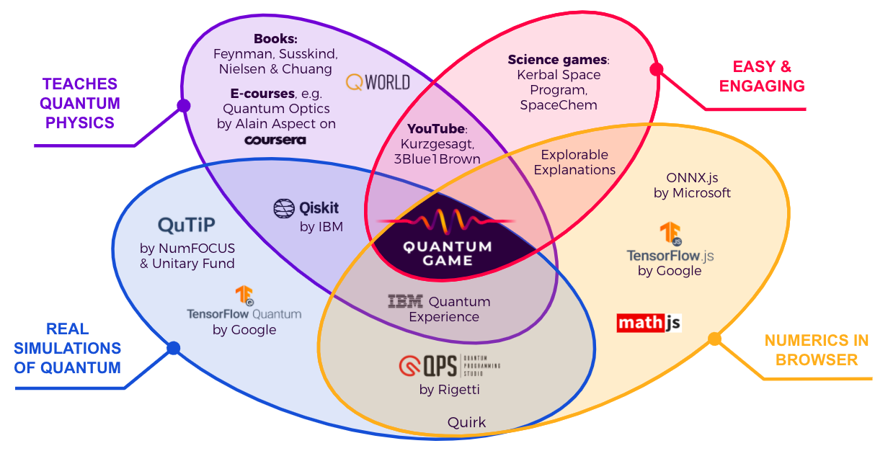

## Join the quantum revolution before your competition does!

“_This is the decade that quantum computing gets real_”  
Katie Pizzolato, director at IBM QStart

<!-- TODO This image should be text -->

Sources: [BCC Research](https://www.bccresearch.com/market-research/information-technology/quantum-computing-technologies-and-global-markets.html) [BCG](https://www.bcg.com/publications/2019/quantum-computers-create-value-when)

<!-- ## 52.9%
Quantum computing market
annual growth rate, 2022-2027
[BCC Research] (https://www.bccresearch.com/market-research/information-technology/quantum-computing-technologies-and-global-markets.html)

## $25-50B
Quantum technologies: estimated operating income in 10 years (including: materials, finance, pharm)
[BCG] (https://www.bcg.com/publications/2019/quantum-computers-create-value-when) -->

---

Quantum physics not only sparks imagination but there also is a growing need for people from various fields to be able to harness its power.

The interest in quantum is growing fast but there is **a shortage of simple and engaging interactive tools** for education and research.
The current stage can be compared to using a pen & paper in computer science.

At Quantum Flytrap we make in-browser simulations & visualizations of quantum mechanics. We are building a go-to place for learning quantum before the quantum computing revolution takes off. With computing left to computers we offer ground-breaking tools for education and research.

Our first product - “quantum LEGO bricks” - is a virtual lab and (soon) a puzzle game. It can be used to set the first steps in the quantum world, teach at any level, and prototype new experiments.

---

## Contact

Contact us at <piotr@quantumflytrap.com> for further details on the investment opportunity.
