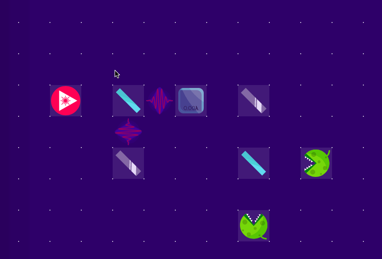
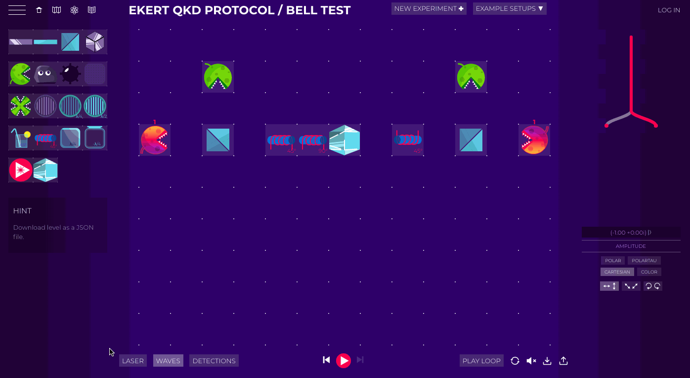

## What is Virtual Lab and how to use it

Virtual Lab <https://lab.quantumflytrap.com/> is a simulation and visualization of quantum information and computing by [Quantum Flytrap](./).

Drag & drop elements to the board to build setups.

Right-clink on an element to change its parameters.

Press the play button (bottom of the board) to start a simulation. Switch between view modes.

Use quantum state viewer to check the current state of the system. Use the many-world tree to explore all possible outcomes.

