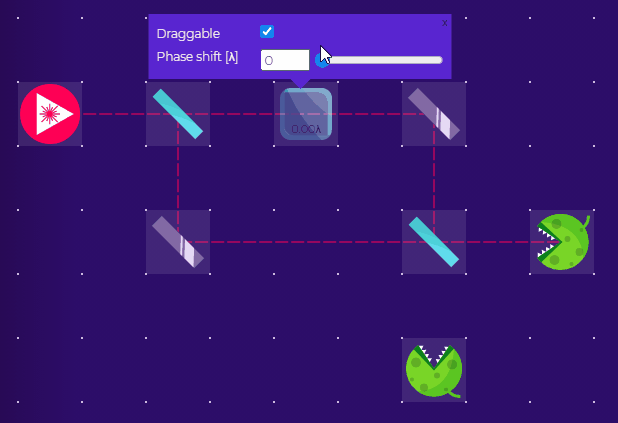
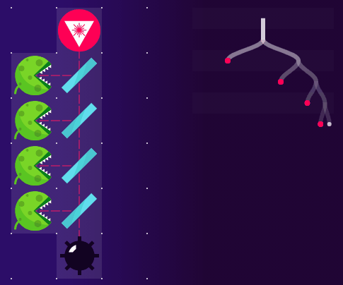
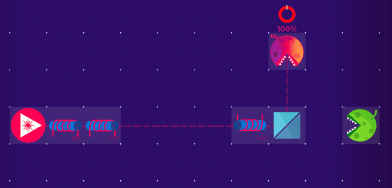
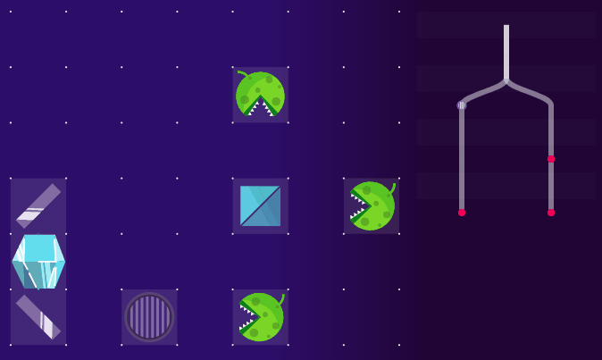
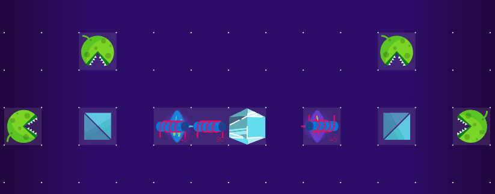
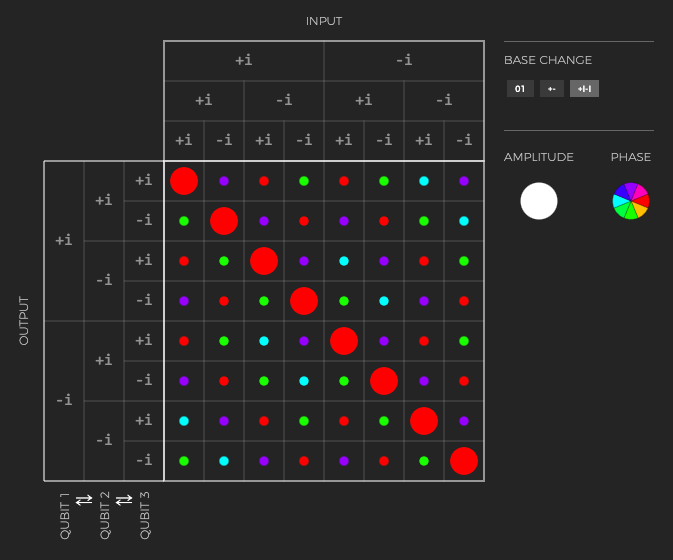
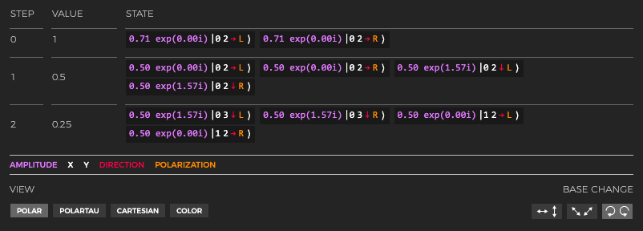

## Virtual Lab for scientists

Virtual Lab is a virtual optical table. With a drag and drop interface, you can show phenomena, recreate existing experiments, and prototype new ones.

Within this environment it is possible to recreate interference, quantum cryptography protocols, to show entanglement, Bell test, quantum teleportation, and the many-worlds interpretation.

Interactive: <https://lab.quantumflytrap.com/lab/mach-zehnder>

More details in our recent preprint [P. Migdał, K. Jankiewicz, P. Grabarz, et al. "Visualizing quantum mechanics in an interactive simulation - Virtual Lab by Quantum Flytrap", arXiv:2203.13300](https://arxiv.org/abs/2203.13300).

## Key features

- Create arbitrary setup in a virtual optical lab
- Display of quantum state (so you can look up what happens, step by step)
- Dynamic change of basis
- Up to 3 entangled photons
- Many-worlds tree to show all possible outcomes at the same time
- Display of quantum operators, with their tensor structure

Interactive: <https://lab.quantumflytrap.com/lab/feed-us-everett>

## For your classes

If you teach classical optics (polarization, optical activity, interference), quantum physics (superposition, entanglement), quantum information & cryptography (Bell inequality, BB84, Ekert protocol). From a simple level of a beamsplitter, to more advanced e.g. unambiguous discrimination of non-orthogonal states.

We prepared a few [classical setups](https://lab.quantumflytrap.com/experiments). You are free to modify them, or make your own from the scratch.

Interactive: <https://lab.quantumflytrap.com/lab/bb84>

Interactive: <https://lab.quantumflytrap.com/lab/conditional-state>

Interactive: <https://lab.quantumflytrap.com/lab/ekert-bell>

## For your materials and slides

Our tools can be used in any quantum context, also outside of our Quantum Lab environment. For example: quantum chemistry, abstract quantum computing, energy levels, or even other modes of light (e.g. spatial degrees of freedom such as orbital angular momentum).

### ⟨𝜑|𝜓⟩.vue

[bra-ket-vue / ⟨𝜑|𝜓⟩.vue](https://github.com/Quantum-Game/bra-ket-vue) for interactive operators and kets.
It works for any discrete states, also defined by you.
Supported by the [Unitary Fund](https://unitary.fund/).
Examples:

- [Quantum logic gates for a single qubit, interactively](https://quantumflytrap.com/blog/2021/qubit-interactively/)
- Quantum Game element encyclopedia (e.g. [Faraday rotator](https://quantumgame.io/info/faraday-rotator)).
- Presentation with Reveal.js (RISE in Jupyter Notebook): <https://p.migdal.pl/piterpy-matrix/#/17>
- Presentation with R Markdown Raveal.js <http://p.migdal.pl/nyc-qc-braketvue/#/>
- Distill in R Markdown: <https://p.migdal.pl/bra-ket-vue-art/>
  - [Quantum computing states and operators](https://p.migdal.pl/bra-ket-vue-art/ket.html)
  - [Classic logic operation truth tables](https://p.migdal.pl/bra-ket-vue-art/logic_operations.html)

### Quantum Tensors

[Quantum Tensors](https://github.com/Quantum-Game/quantum-tensors) for quantum numerics (quantum computing, optics) inside interactive visualizations. It uses TypeScript (a dialect of JavaScript with types) so that can be used in any modern browser, without installation. It is supported by [Centre of Quantum Technologies, National University of Singapore](https://www.quantumlah.org/).

For example, see [quantum computing example](https://jsfiddle.net/stared/wusev5a9/8/).

## Cited in

Quantum Lab and its direct predecessor Quantum Game with Photons, were cited in papers by multiple research groups:

- B. R. La Cour, M. Maynard, P. Shroff, G. Ko, E. Ellis, 2021., [The Virtual Quantum Optics Laboratory](https://arxiv.org/pdf/2105.07300.pdf)
- C. Foti, D. Anttila, S. Maniscalco, M. L. Chiofalo, 2021., [Quantum Physics Literacy Aimed at K12 and the General Public](https://www.mdpi.com/2218-1997/7/4/86)
- Stephen Ornes, [Quantum games aim to demystify heady science](https://doi.org/10.1073/pnas.1800744115), PNAS February 20, 2018 115 (8) 1667-1669, [PDF](https://www.pnas.org/content/pnas/115/8/1667.full.pdf)
- Matthew S. Leifer, [Gamifying Quantum Theory
  ](https://digitalcommons.chapman.edu/scs_articles/541/), The Quantum Times (2017), [PDF](https://digitalcommons.chapman.edu/cgi/viewcontent.cgi?article=1541&context=scs_articles)
- A. Parakh, P. Chundi, M. Subramaniam, [An Approach Towards Designing Problem Networks in Serious Games](https://doi.org/10.1109/CIG.2019.8848055), 2019 IEEE Conference on Games (CoG), London, United Kingdom, 2019, pp. 1-8, [PDF](https://ieee-cog.org/2019/papers/paper_113.pdf)
- Bob Dorland et al., [Quantum Physics vs. Classical Physics: Introducing the Basics with a Virtual Reality Game](https://doi.org/10.1007/978-3-030-34350-7_37), Games and Learning Alliance. GALA 2019. Lecture Notes in Computer Science, vol 11899. Springer, Cham.
- Zahra Ashktorab, Justin D. Weisz, and Maryam Ashoori. 2019., [Thinking Too Classically: Research Topics in Human-Quantum Computer Interaction](https://doi.org/10.1145/3290605.3300486)
- Is your publication missing? Contact us!

More as [a Google Scholar search](https://scholar.google.com/scholar?hl=en&as_sdt=0%2C5&q=%22quantumgame.io%22+OR+%22quantum+game+with+photons%22&btnG=).

## Collaboration

We would be delighted to collaborate!

- Animations and interactive visualization showcasing your research.
- Creating tools for prototyping your experimental setups.
- Collaborating on research on visualizing quantum mechanics (interfaces, education, the geometry of quantum state).
- Mentoring and support with writing interactive blog posts.

Interested? Mail Piotr Migdał at <piotr@quantumflytrap.com>!
