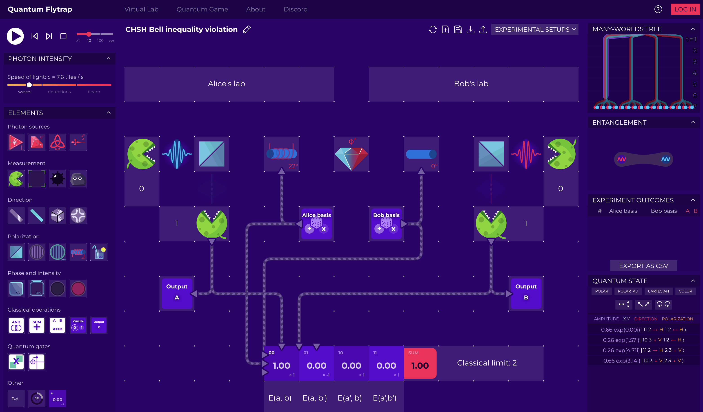
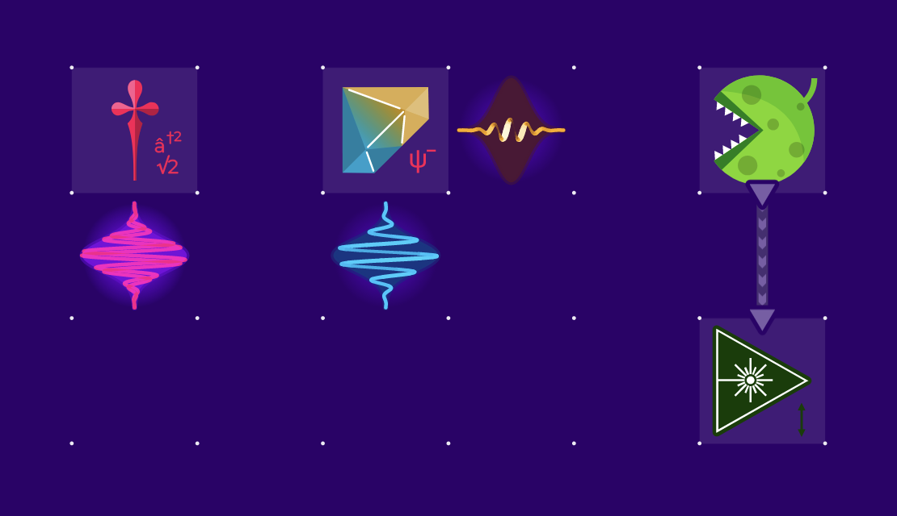
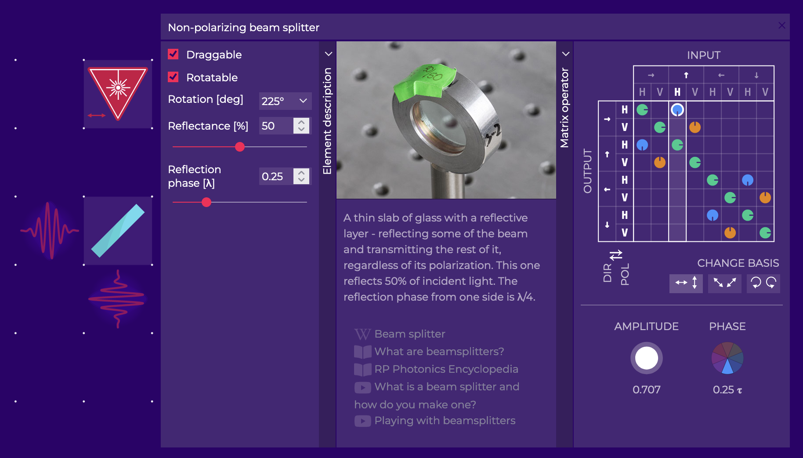

Here is a new update for [Virtual Lab by Quantum Flytrap](https://lab.quantumflytrap.com/), which involves major user interface changes and new features.

We redesigned the main view - from the overall layout to quite a few improvements. Now the sidebars are collapsible - giving you control over what you want to focus on in a given experiment. Now you can:

- Play experiments a few times or in a loop
- Slide between experiment speeds and modes (waves, detection-only, and a macroscopic beam)
- Elements are grouped according to their function
- Many-word tree with mouseover for displaying measurement events
- Entanglement (this one unchanged)
- Experiment outcomes for generating a table for further processing
- Quantum state display with a mouseover interaction - to see how a given ket component is related to the quantum state on the board

From the physics part, we expanded photon sources. For each one you can select a wavelength, which makes it possible to have both indistinguishable particles (if their wavelengths are the same) and distinguishable (by their wavelengths differ).

Finally, we can use the bosonic properties of photons! In particular, now it is possible to simulate a landmark experiment - the Hong-Ou-Mandel two-photon interference. We added as well the bosonic creation operator, a fundamental element of quantum optics and quantum field theory. Additionally, we can switch lasers depending on measurements.

We changed how element descriptions work. Instead of a separate page, it is now all as an on-board popup. So now, with the right click, you can not only edit element properties but also:

- Read a description of the element along with its parameters
- See how it works in a real optical laboratory
- Get a starting point for learning more about its physics with hand-picked links (from Wikipedia pages, through educational videos, to academic publications)
- Explore its transition matrix, which specifies how it changes the photon state

Moreover - this year the Nobel Prize in Physics was awarded to Alain Aspect, John F. Clauser, and Anton Zeilinger - for "experiments with entangled photons, establishing the violation of Bell inequalities, and pioneering quantum information science". Within Virtual Lab, you can:

- [Violate the Bell inequality using the Clauser-Horne-Shimony-Holt setup](https://lab.quantumflytrap.com/lab/bell-inequality)
- Experiment with intrinsic three-photon entanglement of the Greenberger-Horne-Zeilinger (GHZ) state

As you may already know, we published a paper, [Visualizing quantum mechanics in an interactive simulation - Virtual Lab by Quantum Flytrap](https://doi.org/10.1117/1.OE.61.8.081808), Optical Engineering 61(8), 081808 (2022).

While [we are closing Quantum Flytrap as a company](/blog/closing-quantum-flytrap), we are committed to keeping Virtual Lab free, up and running. We love it as much as you do! :)

[Enjoy!](https://lab.quantumflytrap.com/)

Piotr & Klem
